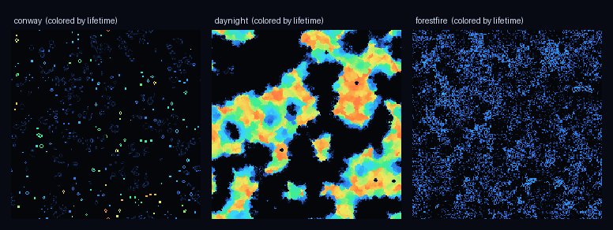
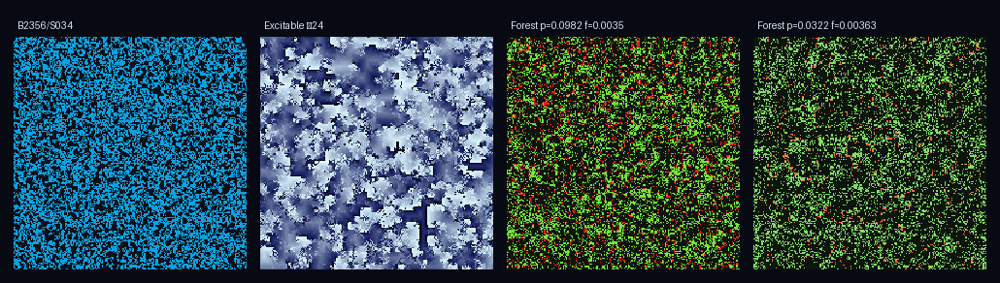
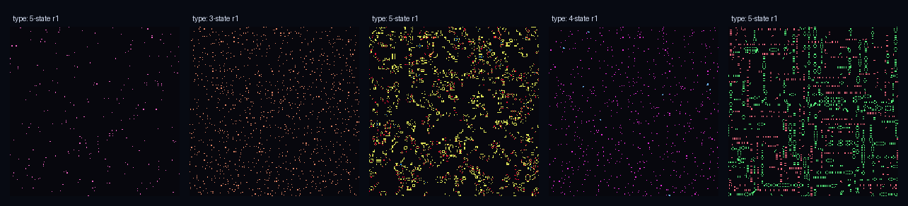
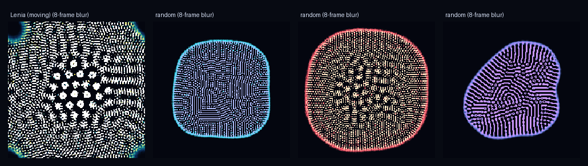
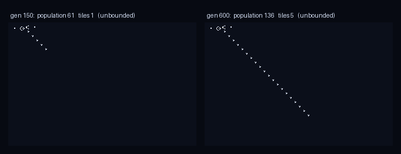

# reality-sim

Simulate **toy universes with pluggable laws of physics**, and watch them evolve
in the browser.

The organizing idea: *inventing new physics == writing a new `LawSet`.* A
`LawSet` is plain data (dimensionality, number of states, neighborhood, rule
parameters, palette). Everything else — the numpy engines, the live viewer, the
future measurement probes — is generic over it, so adding a universe is adding an
entry, not rewriting the stack.

> **What this is and isn't.** These are *toy* universes: discrete cellular
> automata whose rules we choose. They let us ask big questions in a well-posed
> way — *how fast can a signal travel here? can a structure survive crossing into
> a universe with different rules?* — and get real, measurable answers **about
> those universes.** They are not a proof about our own physics; we don't have
> reality's true rules in closed form. The value is that every "law of physics"
> is something we can run, watch, and measure.

## Quick start

```bash
pip install -e .          # numpy, scipy, aiohttp
python -m reality_sim.server
# open http://127.0.0.1:8770
```

In the viewer: pick a universe, scrub speed, resize the grid, and **drag on the
canvas to paint structures / inject signals** into a running universe. Hit
**🎲 New random universe** (or `n`) to invent a fresh random law of physics —
each roll is either a random *rule* in a known family (life / excitable / forest
fire) or a whole new *type*: a **generative** multi-state totalistic CA with a
randomly generated transition table. Most of automata-space is chaos, so the type
generator rolls several and keeps the most interesting (scored with the same
[sweep metrics](docs/metrics.md)).
Keyboard: `space` play/pause, `s` step, `r` reseed, `n` new random universe.

Toggle **color cells by → lifetime** to color every cell by how many generations
it has stayed alive (cool = just born, warm = ancient) — it reveals the dynamical
structure state-coloring hides: stable cores vs. churning edges, old-growth vs.
high-turnover. Works in every fixed-grid family.





*Random **rules** (above) vs. procedurally generated **types** (below) — the
totalistic family's random tables produce genuinely new kinds of automata:*



Types come in two flavors so far: **discrete** (totalistic transition tables) and
**continuous** (`lenia` — real-valued cells evolved by a smooth kernel + growth
function, quantized to 256 shades for display). Continuous types look nothing like
the discrete ones — soft, organism-like membranes and cells. The type generator
curates for *sustained motion* (not just structure), so rolls tend to be moving,
membraned "creatures" rather than the static spot-patterns Lenia falls into from a
random soup by default. Tune growth center `μ` / width `σ` live to morph them.



## Headless / batch

```python
import numpy as np
from reality_sim import make_engine, lawsets

eng = make_engine(lawsets.get("excitable"), shape=(512, 512),
                  rng=np.random.default_rng(0))
for _ in range(1000):
    eng.step()
print(eng.stats())          # {'generation': 1000, 'live': ..., 'excited': ...}
```

The engine is fully vectorized (neighbor counts via `scipy.ndimage.convolve`,
`mode="wrap"` → every universe is a torus), so the same code that prototypes at
240² scales to large grids on a bigger machine.

## The universes so far

| id | family | what it is |
|----|--------|------------|
| `conway` | life | B3/S23 — gliders, oscillators, universal computation |
| `highlife` | life | B36/S23 — has a genuine self-replicator |
| `daynight` | life | B3678/S34678 — matter/vacuum-symmetric domains |
| `excitable` | excitable | Greenberg-Hastings, 16 states — spiral waves with a definite signal speed |
| `forestfire` | forestfire | Drossel-Schwabl — stochastic; self-organizes to criticality |
| `lenia` | lenia | continuous CA — real-valued cells, smooth kernel + growth; organism-like "creatures" |

Every universe exposes **live-tunable knobs** in the viewer — edit the law while
it runs and the pattern reacts in place (the grid isn't reset): toggle Conway's
birth/survival bits, stretch the excitable medium's refractory tail, or tip the
forest between smoldering and firestorm with the growth `p` / lightning `f` dials.


### Boundaries: torus or infinite

Universes run on a fixed wrap-around **torus** by default. The **life family** also
has an unbounded **infinite** mode (toggle it in the viewer) — a pattern can grow or
fly away from the origin forever, stored as a sparse hash map of tiles so memory
scales with the live *population*, not the area. A glider tracked for 4,000
generations travels ~1,000 cells using **one tile**; a Gosper gun grows without
bound. Pan/zoom around the endless plane in the viewer. (Space-filling universes
like forest fire stay toroidal — see the honest caveat in
[docs/infinite-grids.md](docs/infinite-grids.md).)



## Rule-space sweeps + ML

The viewer runs one universe; the sweep pipeline runs *thousands* and puts a
model on top, to ask: **can we predict what kind of universe a law makes without
simulating it?** For the life-like family (a law = 18 bits, B0..B8/S0..S8) the
answer is yes ~90% of the time.

```bash
pip install -e ".[ml]"      # adds scikit-learn, pandas, matplotlib
python -m reality_sim.sweep    --n 4000 --size 64 --steps 250 --out data/sweeps/life.parquet
python -m reality_sim.analysis --in data/sweeps/life.parquet --out data/sweeps
```

The sweep evaluates ~560 universes/second across all cores (4,000 laws in <8s),
measuring each one's *free* dynamics (no probing). The analysis then clusters
rule-space into four regimes — **Dead / Frozen / Complex / Chaotic** — and trains
RandomForests to predict a law's regime (**CV accuracy 0.905**) and activity
(**CV R² 0.873**) from its bits alone. The blind search rediscovers Conway and
HighLife in the Complex "edge of chaos" corner. Full write-up and figures in
[docs/sweeps.md](docs/sweeps.md).


## Documentation

- [docs/concepts.md](docs/concepts.md) — what these toy universes are, and the honest scope
- [docs/architecture.md](docs/architecture.md) — how the package fits together
- [docs/protocol.md](docs/protocol.md) — the websocket wire protocol
- [docs/adding-a-universe.md](docs/adding-a-universe.md) — add a law-set or a whole engine family
- [docs/infinite-grids.md](docs/infinite-grids.md) — the unbounded-plane (tiled) mode for the life family
- [docs/metrics.md](docs/metrics.md) — the dynamical features a sweep measures
- [docs/sweeps.md](docs/sweeps.md) — the rule-space sweep + ML pipeline

## Architecture

```
reality_sim/
  lawset.py     LawSet — the portable spec of one universe's physics
  engine.py     numpy engines (family "life", "excitable") + make_engine()
  lawsets.py    the library of concrete universes
  server.py     aiohttp: streams binary grid frames over a websocket
frontend/       canvas viewer + controls (vanilla JS, no build step)
```

**Wire protocol.** Client sends JSON commands (`play`/`pause`/`step`/`reset`/
`set_lawset`/`set_size`/`set_fps`/`paint`). Server streams binary frames
(`<uint32 w><uint32 h><uint32 generation>` + row-major `uint8` states) plus a
JSON `status` on structural changes. One sim loop per connection is the sole
writer, so there are no interleaved-send races.

## Roadmap (the north star)

- **✅ ML-driven rule search** — sweep rule-space, learn the law→behavior map.
  Done for the life-like family; see [docs/sweeps.md](docs/sweeps.md).
- **✅ infinite grids** — unbounded tiled plane for the life family; see
  [docs/infinite-grids.md](docs/infinite-grids.md). Next: extend the tiling to the
  excitable family, and 3D.
- **✅ generative types** — the `totalistic` family (discrete transition tables)
  and `lenia` (continuous kernel + growth) generate new *kinds* of automata,
  curated by the sweep metrics. Two type-primitives so far.
- **more type-primitives** — extend the grammar: 1D elementary CA (Rule 30/110,
  à la *A New Kind of Science*), signed-distance-field / level-set automata
  (shapes that grow, merge, and relax under curvature flow), larger-than-life,
  reaction-diffusion — all sampled and ML-curated.
- **active search** — use the learned surrogate + Bayesian optimization to
  *propose* laws in the rare Complex corner instead of sampling uniformly.
- **complexity / replication frontier** — measure how fast self-replicating or
  computing structure arises (proxy for "how fast could a civilization bootstrap
  physics?").
- **signal speed / light-cone** *(probing)* — perturb one cell, measure how fast
  the disturbance front spreads; hunt for laws where structured signals outrun the
  naive 1-cell/generation bound ("is FTL possible *here*?").
- **universe boundaries** — stitch two law-sets across a wall; transplant a stable
  structure across it and measure whether it survives, dissolves, or detonates.
- **new engine families** — continuum fields / N-body, then a quantum wavefunction
  engine, all behind the same `LawSet` seam.

See [`BRIEF.md`](BRIEF.md) for the kickoff framing.
