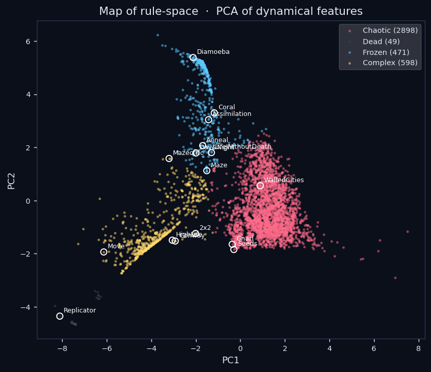
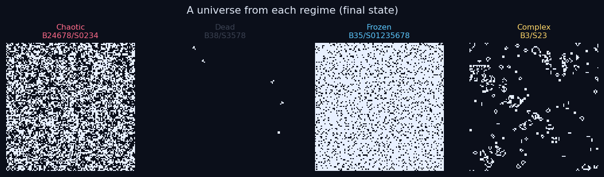
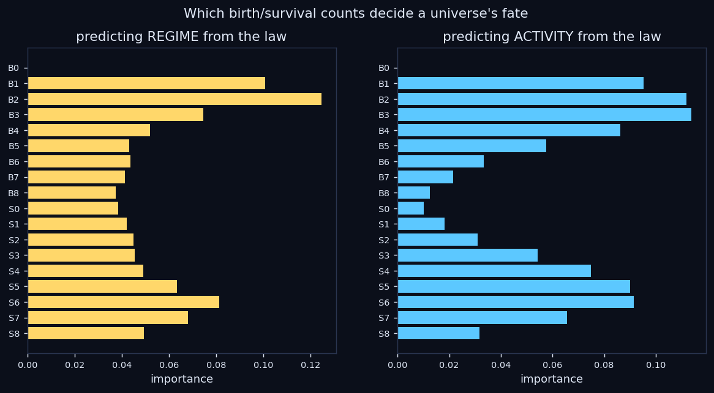

# Sweeps + ML: learning the map from law to universe

The viewer runs **one** universe at a time. This pipeline runs *thousands* — it
sweeps rule-space, measures each universe's free evolution, and puts a model on
top to answer the real question: **given a law of physics, can we predict what
kind of universe it makes — without simulating it?**

For the life-like family the answer turns out to be **yes, ~90% of the time.**

## Scope (what this is and isn't)

- **Single-universe substrate.** Every run is one self-contained universe on a
  torus. We are *not* stitching universes together or crossing boundaries — that
  is a separate future direction. Here we sweep the *rule* of one substrate.
- **No probing.** We characterize a universe by observing its free evolution, not
  by perturbing it and measuring a response. See [metrics.md](metrics.md).
- **The search space** is the life-like family: a birth set B and survival set S
  over neighbor counts {0..8} — exactly **18 bits**, so 2¹⁸ = 262,144 possible
  laws. See [rulespace](../reality_sim/rulespace.py).

## The pipeline

```
rule-space  ──sweep()──►  one row per universe   ──analyze()──►  map + model + figures
(18-bit laws)             (18 law bits + 12          (KMeans regimes, PCA map,
                           dynamical features)        RandomForest law→behavior)
```

Two commands:

```bash
# 1. generate data — evaluate 4000 random laws (+ landmark rules) across all cores
python -m reality_sim.sweep --n 4000 --size 64 --steps 250 --reps 2 \
       --out data/sweeps/life.parquet

# 2. learn from it — cluster, name regimes, train models, render figures
python -m reality_sim.analysis --in data/sweeps/life.parquet --out data/sweeps --k 4
```

The sweep is embarrassingly parallel (one process per rule via a process pool):
**~560 universes/second on a 28-core workstation** — 4,000 laws in under 8
seconds. The exact same code scales to a cluster for a full 262k census; this is
the "prototype fast, then run the big sweep on a supercomputer" path.

## What comes out

### 1. Rule-space clusters into four regimes

KMeans on the standardized feature vectors finds four clean dynamical regimes,
named by matching each cluster's mean profile to an archetype
(`Dead / Frozen / Complex / Chaotic`). From a 4,016-rule sweep:

| regime | count | final_density | mean_activity | spatial_entropy | meaning |
|---|---|---|---|---|---|
| **Dead** | 49 | 0.00 | 0.00 | 0.00 | everything vanishes |
| **Frozen** | 471 | 0.83 | 0.02 | 1.94 | fills up / freezes into stasis |
| **Complex** | 598 | 0.14 | 0.01 | 1.69 | sparse, structured, sustained — the edge of chaos |
| **Chaotic** | 2898 | 0.50 | 0.52 | 3.79 | boiling noise |

Most random laws are chaotic; the interesting Complex regime is rare — which is
exactly why finding it is worth a search.


The interpretable view: **sustained activity** (order→chaos) vs. **final
density**. Frozen laws line the activity≈0 edge; the Chaotic cloud fills the
high-activity region; the **Complex** island sits at low density and low-but-
nonzero activity — and that is exactly where **Conway** and **HighLife** land.



The same clusters in PCA space, with the landmark rules annotated — a "map of
possible universes."

### 2. The regimes are visually real

One representative universe (final state) from each regime — the labels are not
just numbers, they are visibly different kinds of world:



### 3. A universe's fate is predictable from its law

Two RandomForests trained on the raw 18 law-bits (nothing about the simulation):

- **law bits → regime**: 5-fold CV accuracy **0.905**
- **law bits → activity**: 5-fold CV R² **0.873**

So you can predict what kind of universe a law makes ~90% of the time *without
running it*. The feature importances say **which** bits matter:



The low-count **birth** rules dominate — `B2`, `B1`, `B3` are the top drivers of
both regime and activity. That is the physical intuition made quantitative: how
easily the vacuum ignites from a sparse neighborhood is what sets a universe's
temperament. (`B0` sits at ~0 importance — it is held constant, a nice sanity
check that the model uses information, not noise.)

### 4. The search rediscovers the classics — and finds new neighbors

Ranking Complex universes by a Conway-like "interest" heuristic (sparse,
aperiodic, sustained-but-low activity, moderate entropy) surfaces:

| rule | note |
|---|---|
| B3/S23 | **Conway's Life** |
| B36/S23 | **HighLife** |
| B37/S23 | "DryLife" — a known Conway cousin |
| B367/S01367, B3568/S0146, … | unnamed rules in the same corner, worth a look in the viewer |

That the blind search re-derives Conway and HighLife from 4,000 random laws is
the validation that the whole map means something.

## Validation: the landmark rules land where theory says

Sixteen famous rules are swept alongside the random ones as ground-truth
landmarks. Every one lands in a defensible regime:

| regime | landmark rules |
|---|---|
| Complex | Conway, HighLife, 2x2, Move, Mazectric |
| Chaotic | Seeds, Gnarl, WalledCities |
| Frozen | Coral, Maze, LifeWithoutDeath, Day&Night, Diamoeba, Anneal, Assimilation |
| Dead | Replicator (from a dense 50% soup it annihilates) |

## Outputs

`analyze()` writes to the `--out` directory:

- `report.md` — the numbers above, regenerated per sweep
- `analyzed.parquet` — the full table with `cluster`, `phase`, PCA coords, `interest`
- `figures/` — `phase_map.png`, `phase_diagram.png`, `importances.png`, `exemplars.png`

## Next

- **Bigger sweeps / full census** on a cluster; larger grids and step counts to
  de-noise the rare Complex regime.
- **Active search** — use the surrogate + Bayesian optimization to *propose* laws
  in the Complex corner instead of sampling uniformly.
- **Other families** — the same sweep/metrics machinery applies to the excitable
  medium's parameters, and to future engine families, behind the same interface.
